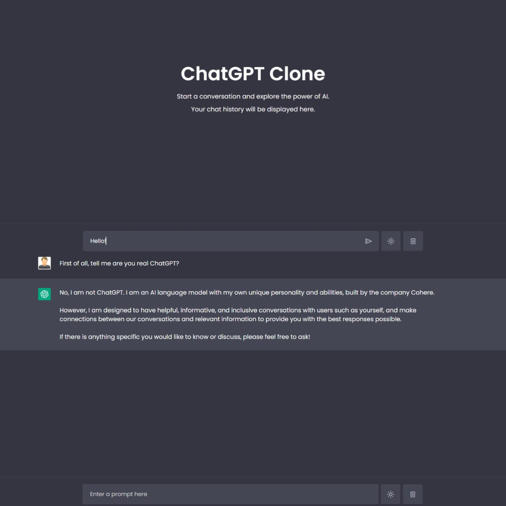

# ChatGPT Clone
 **DESCRIPTION**  
--> ChatGPT is a revolution in the world of artificial intelligence, offering users exceptional text-generation capabilities. This advanced technology enables interactive communication and content creation, making it a popular tool for many. This project (ChatGPT-Clone) offers similar capabilities, but uses the Cohere API instead of the OpenAI API. The application supports dark and light themes, enabling easy switching between dark and light modes (theme-button). Chat conversations are automatically saved locally on the device, allowing users to resume their conversations upon reopening and refreshing the page. Additionally, users can clear the entire chat history as needed (delete button).  

**SCREENSHOTS**  
**Screenshot 1**  

**Screenshot 2**  

**Screenshot 3**  

**FUTURE DEVELOPMENT**  
- > User registration and login (multi-user functionality).  
- > Ability to save multiple conversations (database implementation).  
- > Enabling the editing of user questions.  
- > Allowing users to attach a file, image, or other document.   
- > Read aloud and stop generating functionality.   
- > Improvement of the application's behavior during page refresh.   

 **TECHNOLOGIES AND TOOLS**  

| Technology        | Icon                                                                                           |
|-------------------|------------------------------------------------------------------------------------------------|
| HTML              |  |
| CSS               |   |
| JavaScript        |  |
| Cohere API        |  |
| Git / Git Bash    |  |

